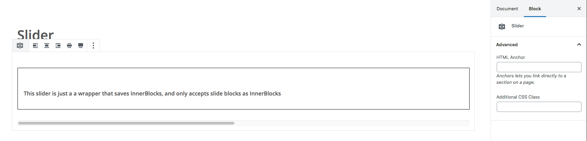
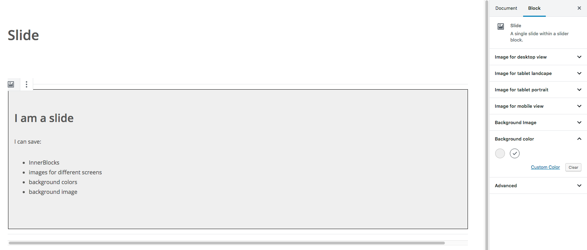

# Gutenberg Slider

A WordPress Gutenberg Slider

## Features

* Slider block wrapper that accepts only slide blocks
* Slide block that saves InnerBlocks

## Setup

Run yarn or npm install

## Changelog

### v0.1.0

* Initial release

## Backend
### The slider block

Default classes are: 'wp-block-jonasm-slider' and 'slider'

### The slide block

Default classes are: 'jonasm-slide' and 'slide'

The slider and the slide blocks also accept classes and ids
